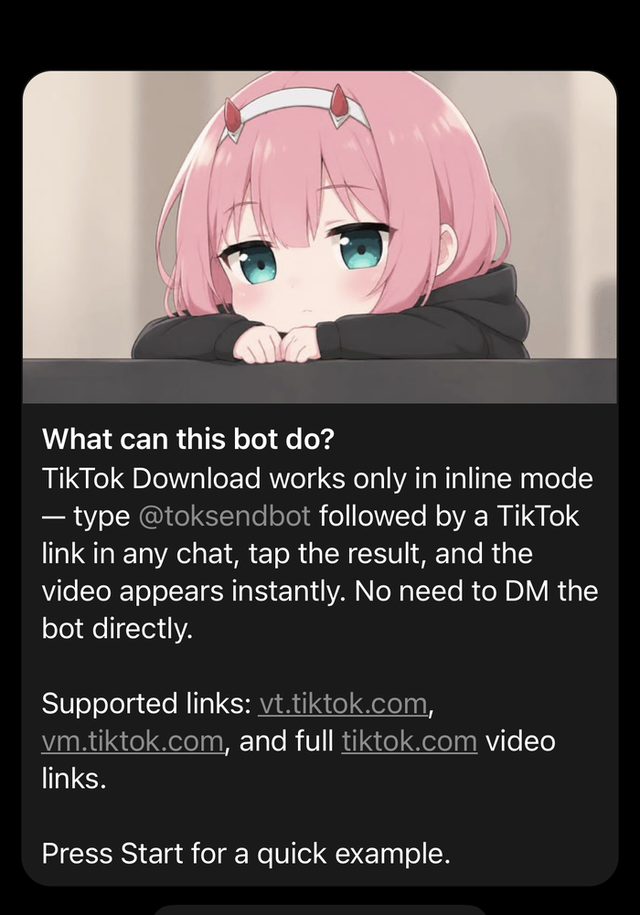

English version · [Русская версия](README.ru.md)

# TikTok Download — inline Telegram bot

The bot downloads a TikTok video from a link and drops it straight into any chat via Telegram's **inline mode** — no need to add the bot to a chat or message it directly.

## How to use it

1. In any chat (private, group, channel — anywhere), start typing `@toksendbot` followed by a TikTok link.
2. A "Send TikTok video" suggestion pops up — tap it.
3. Within a few seconds the placeholder message turns into the actual video, with its caption and author.

Supported links:
- `vt.tiktok.com/...`
- `vm.tiktok.com/...`
- `tiktok.com/@user/video/...`
- `tiktok.com/t/...`

<p align="center">
  <br>
  <sub>Type <code>@toksendbot &lt;link&gt;</code> in any chat and tap the suggestion</sub>
</p>
<p align="center">
  <br>
  <sub>The video lands in the chat with its caption and author</sub>
</p>

Direct messages to the bot aren't supported — `/start` immediately explains that and shows an example.

<p align="center">
  <br>
  <sub>The bot's welcome screen</sub>
</p>
<p align="center">
  <br>
  <sub>What <code>/start</code> replies with</sub>
</p>

---

## How it works

- **`src/index.ts`** — entry point: loads `.env`, creates the bot and the parser, starts polling or webhook mode, and shuts down cleanly on `SIGINT`/`SIGTERM`.
- **`src/bot.ts`** — all the Telegram logic: handles `inline_query` (answers instantly with a placeholder, since Telegram inline queries must be answered fast while parsing a video takes seconds) and `chosen_inline_result` (the actual download only starts once the user taps the result). Already-downloaded videos are cached in memory by URL and by video id, so repeated requests answer instantly by reusing the Telegram `file_id`.
- **`src/tiktok.ts`** — the TikTok parser, built on **Puppeteer** (`puppeteer-extra` + `puppeteer-extra-plugin-stealth`). A plain `fetch`/`curl` gets a 403 from TikTok's protection (Akamai/Slardar fingerprints the TLS/HTTP2 handshake and serves a JS challenge), so the video page is loaded in a real headless Chromium instance instead. The stealth plugin patches automation fingerprints such as `navigator.webdriver`. Video metadata (author, description, dimensions) is read from the JSON embedded in the page HTML (`__UNIVERSAL_DATA_FOR_REHYDRATION__`), while the video file itself is captured from the page's `video/mp4` network response as it loads. Random delays and a one-time "warm-up" visit to the homepage are added so the browser behaves less like a bot.
- **`src/messages.ts`** — all bot texts in English and Russian, picked based on the user's Telegram `language_code`.

---

## Installing it yourself

### 1. Requirements
- Node.js version pinned in `.nvmrc` (currently `v24.18.0`)
- pnpm
- Linux/macOS/Windows able to run Chromium (Puppeteer downloads it automatically on install)

### 2. System libraries for Chromium (Linux only)
Headless Chromium on a bare Linux server (Ubuntu/Debian) needs system libraries that minimal server images usually don't have:

```bash
sudo apt-get update && sudo apt-get install -y \
  ca-certificates fonts-liberation libasound2 libatk-bridge2.0-0 \
  libatk1.0-0 libc6 libcairo2 libcups2 libdbus-1-3 libexpat1 \
  libfontconfig1 libgbm1 libgcc1 libglib2.0-0 libgtk-3-0 \
  libnspr4 libnss3 libpango-1.0-0 libx11-6 libx11-xcb1 libxcb1 \
  libxcomposite1 libxcursor1 libxdamage1 libxext6 libxfixes3 \
  libxi6 libxrandr2 libxrender1 libxss1 libxtst6 lsb-release \
  xdg-utils libu2f-udev libvulkan1
```

If the server has no virtual display, run through `xvfb` instead — `package.json` already has a `pnpm xvfb` script for that (needs the `xvfb` package: `sudo apt-get install -y xvfb`).

### 3. Project setup
```bash
pnpm install        # also downloads Chromium for Puppeteer
cp .env.example .env
```

Fill in `.env`:
```
BOT_TOKEN=your-telegram-bot-token
BOT_MODE=polling     # or webhook for production behind nginx
```

### 4. Setting up the bot in BotFather
1. Message [@BotFather](https://t.me/BotFather) → `/newbot`, pick a name and username, grab the token — put it into `BOT_TOKEN`.
2. Turn on inline mode: `/setinline` → select your bot → enter a placeholder text (e.g. "Send TikTok video").
3. **Required:** `/setinlinefeedback` → select your bot → **Enabled** — without this Telegram never sends the bot a `chosen_inline_result` update, so it can't tell when a user actually picked a result to start downloading.
4. (optional) `/setdescription` and `/setabouttext` for the bot's profile card.

### 5. Running
```bash
pnpm dev      # development (tsx watch)
pnpm build && pnpm start   # production
pnpm xvfb     # run through a virtual display, if needed
```

For webhook mode also set `WEBHOOK_DOMAIN`, `WEBHOOK_PATH` and `WEBHOOK_PORT` in `.env` — the bot only binds `127.0.0.1`; something like nginx needs to reverse-proxy it over HTTPS.

---

### Contact
Questions and suggestions: Telegram — [@cline_z](https://t.me/cline_z)
