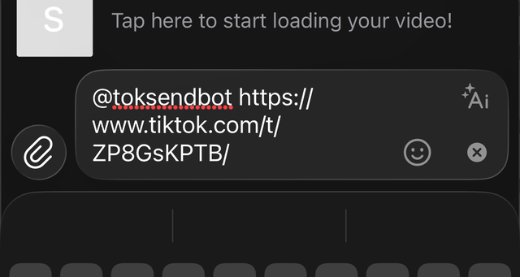
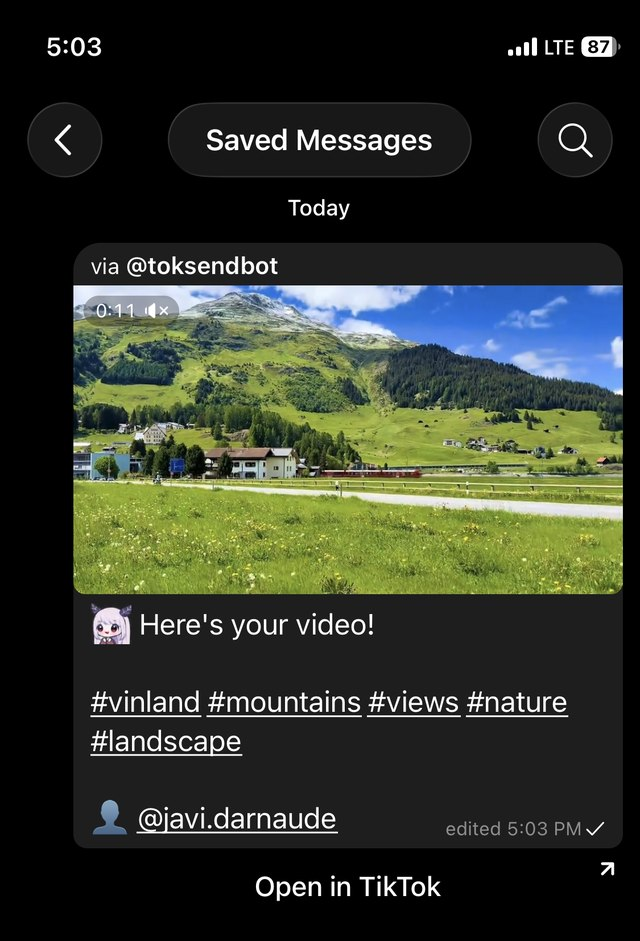
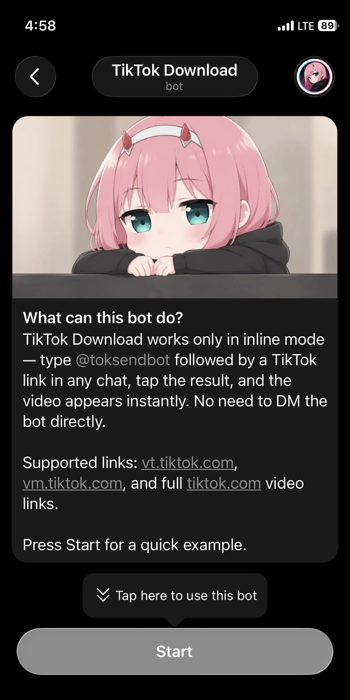
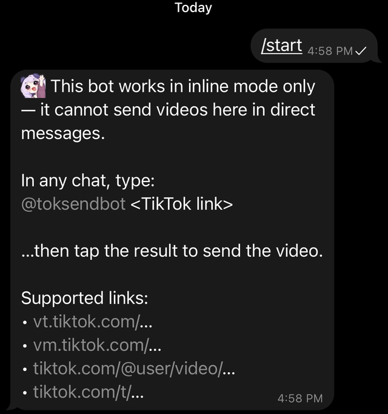

[English version](README.md) · Русская версия

# TikTok Download — inline-бот для Telegram

Бот скачивает видео из TikTok по ссылке и отправляет его прямо в чат через **inline-режим** — не нужно добавлять бота в чат или писать ему в личку.

## Как этим пользоваться

1. В любом чате (личном, группе, канале — где угодно) начните сообщение с `@toksendbot`, а затем вставьте ссылку на TikTok-видео.
2. Появится всплывающая подсказка «Send TikTok video» — нажмите на неё.
3. Через несколько секунд сообщение-заглушка сменится на само видео с описанием и автором.

Ссылки на фото-посты (слайд-шоу) работают точно так же — бот сам склеивает изображения и фоновую музыку в короткое видео перед отправкой.

Поддерживаемые ссылки:
- `vt.tiktok.com/...`
- `vm.tiktok.com/...`
- `tiktok.com/@user/video/...`
- `tiktok.com/@user/photo/...`
- `tiktok.com/t/...`

<p align="center">
  <br>
  <sub>Наберите <code>@toksendbot &lt;ссылка&gt;</code> в любом чате и нажмите на подсказку</sub>
</p>

<p align="center">
  <br>
  <sub>Видео приходит в чат вместе с описанием и автором</sub>
</p>

Личные сообщения боту не поддерживаются — при команде `/start` он сразу объясняет это и показывает пример использования.

<p align="center">
  <br>
  <sub>Экран приветствия бота</sub>
</p>

<p align="center">
  <br>
  <sub>Что отвечает бот на <code>/start</code></sub>
</p>

---

## Как это устроено

- **`src/index.ts`** — точка входа: читает `.env`, создаёт бота и парсер, запускает polling или webhook, корректно завершает работу по `SIGINT`/`SIGTERM`.
- **`src/bot/`** — вся логика Telegram, разложенная по смыслу: `index.ts` навешивает обработчики `inline_query`/`chosen_inline_result`, `cache.ts` хранит кэш URL/id видео → `file_id` из Telegram и собирает подписи, а `deliver.ts` выполняет сам цикл парсинг → загрузка → редактирование сообщения. `inline_query` мгновенно отвечает заглушкой (inline-запросы Telegram обязаны получить ответ быстро, а парсинг видео занимает секунды) и параллельно сразу запускает парсинг в фоне, так что к моменту, когда пользователь нажмёт на результат, видео нередко уже готово. `chosen_inline_result` срабатывает, когда результат действительно выбрали, и превращает заглушку в готовое видео. Уже скачанные видео кэшируются по URL и по id видео, поэтому повторные запросы отвечают мгновенно, переиспользуя `file_id` из Telegram.
- **`src/tiktok/`** — парсер TikTok, разложенный по смыслу: `browser.ts` владеет пулом браузеров **Puppeteer** (`puppeteer-extra` + `puppeteer-extra-plugin-stealth`), разовым прогревом главной страницы и случайными задержками между запросами; `urls.ts` распознаёт ссылки TikTok, включая ссылки на фото-посты; `video.ts` открывает страницу, отличает WAF-челлендж от по-настоящему отсутствующего видео и сверяет захваченные ответы `video/mp4` со ссылками из объекта `video` распарсенного item'а (`playAddr`, `downloadAddr`, `bitrateInfo`), прежде чем принять один из них, потому что страница может отдавать и другие `video/mp4` ответы, не являющиеся самим видео; `types.ts` хранит общий тип `ParsedVideo` и константы настройки. Обычный `fetch`/`curl` получает 403 от защиты TikTok (Akamai/Slardar фильтрует по TLS/HTTP2-отпечатку и подсовывает JS-челлендж), поэтому страница видео открывается в настоящем headless Chromium, а метаданные берутся из встроенного в HTML JSON (`__UNIVERSAL_DATA_FOR_REHYDRATION__`). Завершённый парсинг остаётся переиспользуемым 45 секунд, поэтому спекулятивный парсинг из `bot/index.ts` и последующий вызов из `chosen_inline_result` обычно схлопываются в одну навигацию браузера вместо двух. Когда встроенный JSON отсутствует, парсер различает WAF-челлендж (можно повторить — пользователю показывается «попробуйте через минуту») и по-настоящему заблокированное/отсутствующее видео (показывается «приватное, удалено или недоступно в регионе»); что на самом деле чаще всего означает второй случай — см. «Расположение хостинга» ниже.
- **`src/tiktok/photoPost.ts` + `ffmpeg.ts`** — у фото-постов TikTok (`tiktok.com/@user/photo/...`) вообще нет видео, только слайд-шоу картинок с музыкальной дорожкой, и встроенного JSON у них тоже нет — эти данные приходят через клиентский XHR, который делает сама страница TikTok, и `photoPost.ts` его дожидается. Затем он скачивает каждую картинку и аудиодорожку через тот же приём с загрузкой через Chromium, что и для видео, а `ffmpeg.ts` вызывает **ffmpeg**, чтобы собрать их в настоящий mp4 (каждая картинка показывается `длительность музыки ÷ число картинок` секунд, либо ровно 3 секунды каждая, если музыку с длительностью получить не удалось) — так что дальше по пайплайну (кэш, загрузка в Telegram) это обычное видео.
- **`src/messages.ts`** — все тексты бота на английском и русском языках, выбор языка по `language_code` пользователя из Telegram. Идентификаторы `tg-emoji` в `EMOJI` — это личный выбор premium-эмодзи автора бота; при форке их стоит заменить на свои, но ничего не сломается, если этого не сделать — Telegram просто покажет обычный юникод-эмодзи, зашитый как fallback в каждый вызов `emoji()`.

---

## Расположение хостинга

От того, где размещён бот, зависит, отдаст ли TikTok видео вообще — независимо от того, что делает stealth-плагин.

В продакшене мы столкнулись с тем, что `itemInfo` возвращается пустым, а `statusCode` равен `10204` со `statusMsg`, содержащим `ru_cross_border_block,ru_watch_video` — это TikTok применяет российские правила трансграничной передачи данных. Это решение зависит от **ASN, которому принадлежит IP сервера**, а не от реального местоположения машины, часового пояса или локали браузера, и это совсем другой тип сбоя, чем детекция бота: никакая настройка stealth-плагина, прогрев или джиттер это не исправят.

Эти два сбоя по-разному логируются, и их легко различить:
- `[tiktok] WAF challenge hit for <url>` + крошечная страница (почти пустой `<head>`) → **детекция бота** Akamai/Slardar. Здесь как раз помогают stealth-плагин, прогрев и случайные задержки, уже реализованные в `src/tiktok/browser.ts`.
- `[tiktok] no embedded JSON (unknown cause) for <url>` + страница полного размера (сотни КБ, настоящий `<body>`) → страница загрузилась нормально, но данные видео заблокированы. Это **блокировка по трансграничным правилам/комплаенсу**, и решение — сменить хостинг, а не докручивать stealth.

Если столкнулись со вторым случаем, уводите бота с провайдеров, чьи диапазоны IP известны перепродажей доступа как VPN/прокси для обхода блокировок TikTok из России — такие диапазоны TikTok уже считает подозрительными. Крупные провайдеры (Hetzner, DigitalOcean, Vultr, OVH и т.п.) обычно выглядят как обычный хостинг, а не VPN-узел, и под эту блокировку не попадают.

---

## Установка и запуск у себя

### 1. Требования
- Node.js версии из `.nvmrc` (сейчас `v24.18.0`)
- pnpm
- Linux/macOS/Windows с возможностью запустить Chromium (Puppeteer скачивает его сам при установке зависимостей)
- `ffmpeg` в `PATH` — нужен только для ссылок на фото-посты (слайд-шоу); обычные видео-ссылки работают и без него

### 2. Системные библиотеки для Chromium и ffmpeg (только Linux)
Headless Chromium на "голом" Linux (Ubuntu/Debian) требует системные библиотеки, которых обычно нет на минимальных серверах:

```bash
sudo apt-get update && sudo apt-get install -y \
  ca-certificates fonts-liberation libasound2 libatk-bridge2.0-0 \
  libatk1.0-0 libc6 libcairo2 libcups2 libdbus-1-3 libexpat1 \
  libfontconfig1 libgbm1 libgcc1 libglib2.0-0 libgtk-3-0 \
  libnspr4 libnss3 libpango-1.0-0 libx11-6 libx11-xcb1 libxcb1 \
  libxcomposite1 libxcursor1 libxdamage1 libxext6 libxfixes3 \
  libxi6 libxrandr2 libxrender1 libxss1 libxtst6 lsb-release \
  xdg-utils libu2f-udev libvulkan1
```

Слайд-шоу фото-постов собираются через **ffmpeg**, который не входит в этот список зависимостей и ставится отдельно:
```bash
sudo apt-get install -y ffmpeg
```

Если на сервере нет виртуального дисплея, можно запускать через `xvfb` — в `package.json` уже есть скрипт `pnpm xvfb` (требует пакет `xvfb`: `sudo apt-get install -y xvfb`).

### 3. Установка проекта
```bash
pnpm install        # заодно скачает Chromium для Puppeteer
cp .env.example .env
```

Заполните `.env`:
```
BOT_TOKEN=токен_вашего_бота
BOT_MODE=polling     # или webhook для продакшена за nginx
```

| Переменная | Обязательна | Значение |
| --- | --- | --- |
| `BOT_TOKEN` | всегда | Токен от [@BotFather](https://t.me/BotFather) |
| `BOT_MODE` | всегда | `polling` (по умолчанию, для разработки) или `webhook` (продакшен за реверс-прокси) |
| `WEBHOOK_DOMAIN` | только в режиме `webhook` | Публичный HTTPS-домен, на который Telegram шлёт обновления, например `https://example.com` |
| `WEBHOOK_PATH` | только в режиме `webhook` | Путь URL, который nginx проксирует боту, например `/tg-webhook-path` |
| `WEBHOOK_PORT` | только в режиме `webhook` | Локальный порт, который слушает бот за реверс-прокси |

### 4. Создание бота в BotFather
1. Напишите [@BotFather](https://t.me/BotFather) → `/newbot`, задайте имя и username, получите токен — вставьте его в `BOT_TOKEN`.
2. Включите inline-режим: `/setinline` → выберите бота → введите текст-подсказку (например, «Send TikTok video»).
3. **Обязательно** включите `/setinlinefeedback` → выберите бота → **Enabled** — без этого Telegram не присылает боту событие `chosen_inline_result`, и бот не сможет узнать, когда пользователь выбрал результат, чтобы начать скачивание.
4. (по желанию) `/setdescription` и `/setabouttext` для карточки бота.

### 5. Запуск
```bash
pnpm dev      # разработка (tsx watch)
pnpm build && pnpm start   # продакшен
pnpm xvfb     # запуск через виртуальный дисплей, если нужен
```

Для webhook-режима дополнительно укажите в `.env` `WEBHOOK_DOMAIN`, `WEBHOOK_PATH`, `WEBHOOK_PORT` — бот слушает только `127.0.0.1`, наружу его должен проксировать nginx (или аналог) по HTTPS.

---

## Диагностика проблем

Если бот не может получить видео, лог `src/tiktok/video.ts` укажет на одну из этих причин:

1. **Детекция бота (WAF challenge)** — `[tiktok] WAF challenge hit for <url>` и крошечная захваченная страница. Пользователь видит повторяемую ошибку «попробуйте через минуту», а не «видео недоступно» — парсер различает эти случаи, так что если для точно публичного видео вы видите именно «недоступно», дело не в этом — см. пункт 2. См. «Расположение хостинга» — это как раз случай, для которого нужны stealth-плагин, прогрев и джиттер; если это происходит постоянно, проверьте, что в сборке Chromium действительно применены патчи stealth (а не голый `puppeteer-core`).
2. **Гео-/комплаенс-блокировка** — `[tiktok] no embedded JSON (unknown cause) for <url>` и страница полного размера. Пользователь видит «приватное, удалено или недоступно в регионе», хотя настоящая причина — проблема `ru_cross_border_block`, описанная в «Расположение хостинга» — дело в IP/ASN сервера, а не в браузере, так что донастройка парсера не поможет.
3. **Зависания сети/DNS** — каждая навигация упирается в таймаут `NAV_TIMEOUT_MS` (30 сек), включая прогревочный визит на `tiktok.com/`, а другие сайты с того же хоста настолько же медленные или недоступные. Это не специфично для TikTok — обычно дело в DNS-резолвере хоста или маршрутизации. Сравните `dig tiktok.com` через настроенный резолвер и `dig @1.1.1.1 tiktok.com`; если 1.1.1.1 отвечает нормально, а настроенный резолвер — нет, чините DNS на хосте, а не бота.
4. **Фото-посты не работают, а видео — нормально** — в ошибке упоминается ffmpeg (`ffmpeg is not installed or not on PATH`). Слайд-шоу фото-постов требуют бинарник `ffmpeg` в `PATH` (см. «Установка и запуск у себя»); обычные видео-ссылки ffmpeg вообще не трогают, так что это всплывает только при отправке ссылки вида `tiktok.com/@user/photo/...`.

---

### Контакты
По вопросам и предложениям: Telegram — [@cline_z](https://t.me/cline_z)
